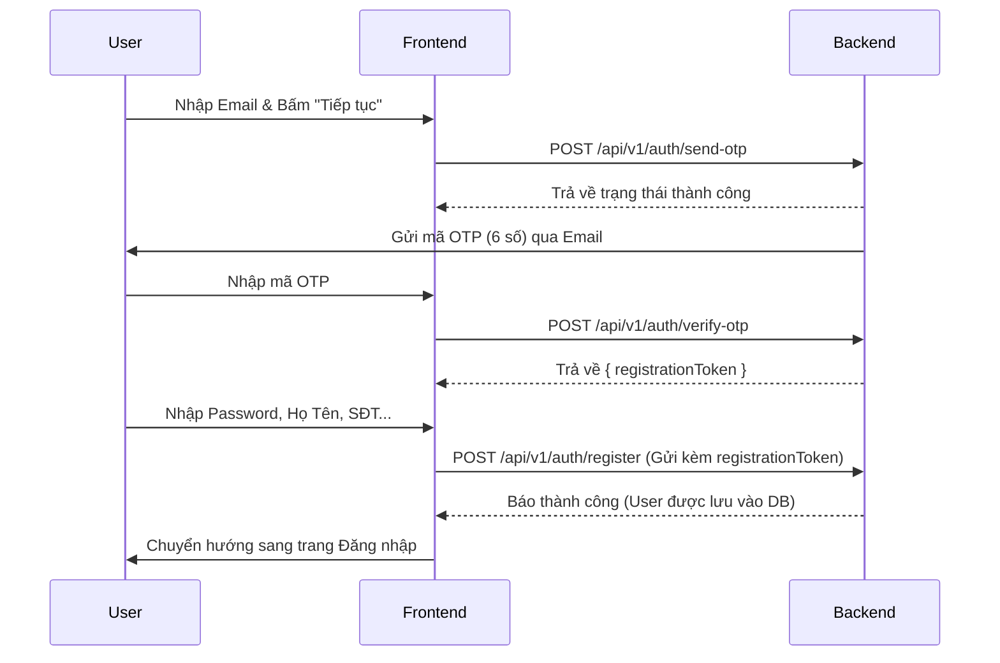
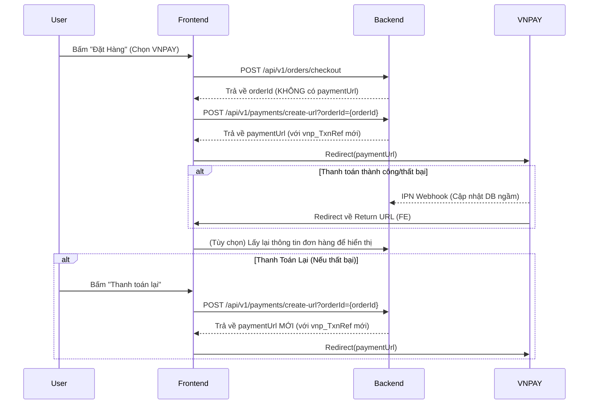

# Hướng Dẫn Tích Hợp Dành Cho Frontend

Tài liệu này tổng hợp hướng dẫn tích hợp cho các luồng nghiệp vụ đã được Backend cập nhật: **Đăng Ký Tài Khoản Mới** và **Thanh Toán VNPAY**.

---

## PHẦN 1: TÍCH HỢP LUỒNG ĐĂNG KÝ TÀI KHOẢN (3 BƯỚC)

Luồng đăng ký đã được thiết kế lại theo chuẩn bảo mật với 3 bước:
1. Nhập Email -> Gửi OTP.
2. Nhập OTP -> Xác thực và nhận về `registrationToken`.
3. Điền thông tin cá nhân kèm `registrationToken` -> Hoàn tất đăng ký.

### Sơ Đồ Luồng Hoạt Động



### Chi Tiết API Cần Dùng

#### 1. API Gửi OTP
- **Endpoint**: `POST /api/v1/auth/send-otp`
- **Mục đích**: Yêu cầu backend gửi mã OTP đến email của người dùng.
- **Request Body**:
```json
{
  "email": "user@example.com"
}
```

#### 2. API Xác Thực OTP
- **Endpoint**: `POST /api/v1/auth/verify-otp`
- **Mục đích**: Frontend gửi mã OTP user nhập lên để verify. Nếu đúng, Backend trả về một token tạm thời (`registrationToken`).
- **Request Body**:
```json
{
  "email": "user@example.com",
  "otp": "123456"
}
```
- **Response**:
```json
{
  "code": 1000,
  "message": "Xác thực OTP thành công",
  "result": {
    "registrationToken": "eyJhbGciOiJIUzI1NiIsInR..." 
  }
}
```

#### 3. API Hoàn Tất Đăng Ký
- **Endpoint**: `POST /api/v1/auth/register`
- **Mục đích**: Gửi thông tin cá nhân kèm theo `registrationToken` vừa nhận ở bước 2 để lưu người dùng xuống DB.
- **Request Body**:
```json
{
  "registrationToken": "eyJhbGciOiJIUzI1NiIsInR...",
  "fullName": "Nguyen Van A",
  "password": "password123",
  "phone": "0987654321" 
}
```

---

## PHẦN 2: TÍCH HỢP LUỒNG THANH TOÁN VNPAY (TÁCH RỜI)

Để giải quyết lỗi trùng lặp mã giao dịch (`vnp_TxnRef`) khi thanh toán lại, tính năng Đặt Hàng (Checkout) và Thanh Toán VNPAY (Payment) đã được tách thành 2 API độc lập.

### Sơ Đồ Luồng Hoạt Động



### Các API Cần Dùng

#### 1. API Đặt Hàng (Checkout)
- **Endpoint**: `POST /api/v1/orders/checkout`
- **Thay đổi quan trọng**:
  - `CheckoutResponse` sẽ **KHÔNG CÒN** chứa trường `paymentUrl`.
  - FE chỉ lấy được `orderId` từ response.

**Response mẫu:**
```json
{
  "code": 1000,
  "message": "Success",
  "result": {
    "orderId": 1234,
    "orderStatus": "PENDING_PAYMENT",
    "finalPaymentMoney": 150000.00
  }
}
```

#### 2. API Lấy URL Thanh Toán (Tạo Mới)
Sau khi có `orderId` từ API Checkout (hoặc khi user bấm "Thanh toán lại" ở Lịch sử đơn hàng).

- **Endpoint**: `POST /api/v1/payments/create-url`
- **Params**: `?orderId={orderId}`
- **Auth**: Bearer Token.

**Cú pháp gọi (Axios example):**
```javascript
const response = await axios.post(`/api/v1/payments/create-url?orderId=${orderId}`, {}, {
  headers: {
    Authorization: `Bearer ${token}`
  }
});

const paymentUrl = response.data.result.paymentUrl;
window.location.href = paymentUrl; // Redirect sang VNPAY
```

### Xử Lý Các Kịch Bản Thực Tế VNPAY

> [!IMPORTANT]
> Dưới đây là các kịch bản Frontend cần nắm để handle trải nghiệm người dùng tốt nhất.

1. **Mua Hàng Mới**:
   - Nhận `orderId` từ API Checkout.
   - Nếu thanh toán VNPAY: Gọi ngay API `create-url` và redirect sang trang thanh toán.
   - Nếu thanh toán COD: Chuyển hướng sang trang "Đặt Hàng Thành Công".
2. **Hủy Thanh Toán Giữa Chừng**:
   - User đang ở trang VNPAY nhưng tắt tab. Đơn hàng ở BE giữ nguyên trạng thái `PENDING_PAYMENT`.
   - Trong trang Lịch Sử Đơn Hàng, FE hiển thị nút "Thanh toán lại". Khi user bấm, FE gọi lại API `create-url` để lấy URL mới (chứa mã giao dịch mới để tránh lỗi VNPAY).
3. **Trang Return URL**:
   - Trang FE xử lý `Return URL` (ví dụ: `http://localhost:5173/payment-result`) nhận tham số từ BE qua query param (vd: `?success=true`).
   - Nếu `success=false`, báo lỗi và hiện lại nút "Thanh toán lại".
