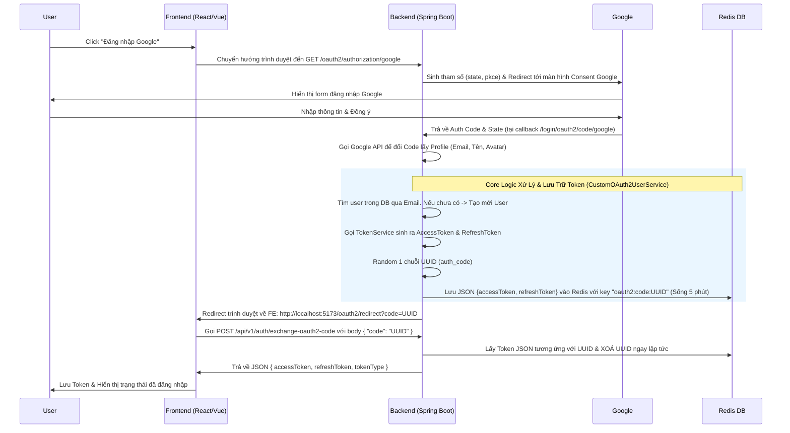

# Báo Cáo Triển Khai OAuth2 Google Login (UUID Exchange Flow)

## 1. Luồng Thực Thi Tổng Thể (Execution Flow)

Luồng đăng nhập qua Google hiện tại được thiết kế theo mô hình bảo mật 2 bước để **bảo vệ Access Token & Refresh Token tuyệt đối**, không để lộ trên URL trình duyệt. 

Dưới đây là sơ đồ trình tự các bước:



---

## 2. Các Thay Đổi Ở Phía Backend (Cách Implement)

Để đạt được luồng trên, Backend đã triển khai các thành phần sau:

1. **`SecurityConfig` & `pom.xml`**:
   - Thêm thư viện `spring-boot-starter-oauth2-client`.
   - Bật `.oauth2Login()` và cấu hình các public endpoint. Spring Security sẽ tự động hứng URL đăng nhập `/oauth2/authorization/google` và URL Google callback `/login/oauth2/code/google`.

2. **`CustomOAuth2UserService`**:
   - Hứng thông tin profile từ Google trả về.
   - Kiểm tra Email: Nếu user chưa tồn tại, tự động insert bản ghi vào database (gắn role `USER`, lưu Avatar, kích hoạt tài khoản `isActive=true`). Nếu tồn tại thì update `googleAccountId`.

3. **`OAuth2LoginSuccessHandler`**:
   - Khi Authentication thành công, thay vì trả luôn token về URL (lỗ hổng của project `web_order` cũ), Handler này gọi `TokenService` để sinh cặp AT+RT thực thụ.
   - Lưu cặp token này vào Redis bằng chuỗi **UUID** (sống trong 5 phút).
   - Redirect Frontend kèm đoạn UUID: `?code=xxxx-xxxx`.

4. **`AuthenticationServiceImpl` & `AuthController`**:
   - Mở 1 API POST `/api/v1/auth/exchange-oauth2-code`.
   - Lấy `AuthResponse` từ Redis ra, trả về cho Client, và **huỷ (delete) key Redis đó luôn** để mã UUID này chỉ được dùng 1 lần duy nhất (phòng chống Replay Attack).

---

## 3. Hướng Dẫn Dành Cho Frontend (API Contract)

Frontend Team không cần sử dụng thư viện rườm rà nào cả, chỉ cần thao tác đúng 2 bước sau:

### Bước 1: Khởi tạo đăng nhập (Initiate Login)
Gắn đường link này vào nút "Đăng nhập với Google":
```html
<a href="http://localhost:8080/easymall/oauth2/authorization/google">Login with Google</a>
```
*(Ghi chú: Thay `localhost:8080/easymall` bằng Base URL của Backend ở môi trường thật)*.

> Trình duyệt sẽ tự chuyển hướng đi Google, và sau đó tự nhảy về trang cấu hình của Frontend (mặc định trong code đang để là `http://localhost:5173/oauth2/redirect`).

### Bước 2: Bắt mã Code ở Frontend và Đổi lấy Token
Tại màn hình URL Frontend bị redirect về (ví dụ `/oauth2/redirect`), URL trên thanh trình duyệt lúc này sẽ có dạng: 
`http://localhost:5173/oauth2/redirect?code=f8d423cc81a14c33...`

Frontend bóc lấy giá trị tham số `code` và gọi API sau:

**API:** `POST /api/v1/auth/exchange-oauth2-code`
**Header:** Bỏ trống (Không truyền Authorization)

**Body Request:**
```json
{
  "code": "f8d423cc81a14c33..." 
}
```

**Response (Thành công - 200 OK):**
```json
{
    "code": 1000,
    "message": "success",
    "result": {
        "accessToken": "eyJhbGciOiJIUzUxMiJ9...",
        "refreshToken": "cdfe07b2-0dc2-482f...",
        "tokenType": "Bearer",
        "expiresIn": 900000
    }
}
```

> [!CAUTION]
> **Lưu ý Lỗi (400 Bad Request):**
> Nếu mã code sai, hoặc **quá 5 phút** kể từ lúc Google trả về mà FE không gọi API này, hệ thống sẽ báo lỗi `error.invalid-oauth2-code`. Bắt buộc User phải thực hiện đăng nhập lại từ đầu.
